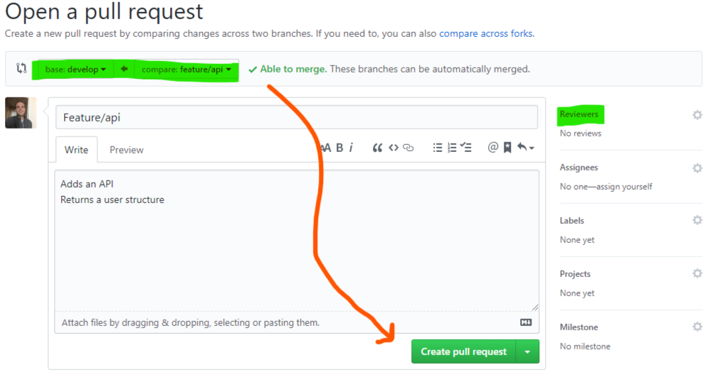
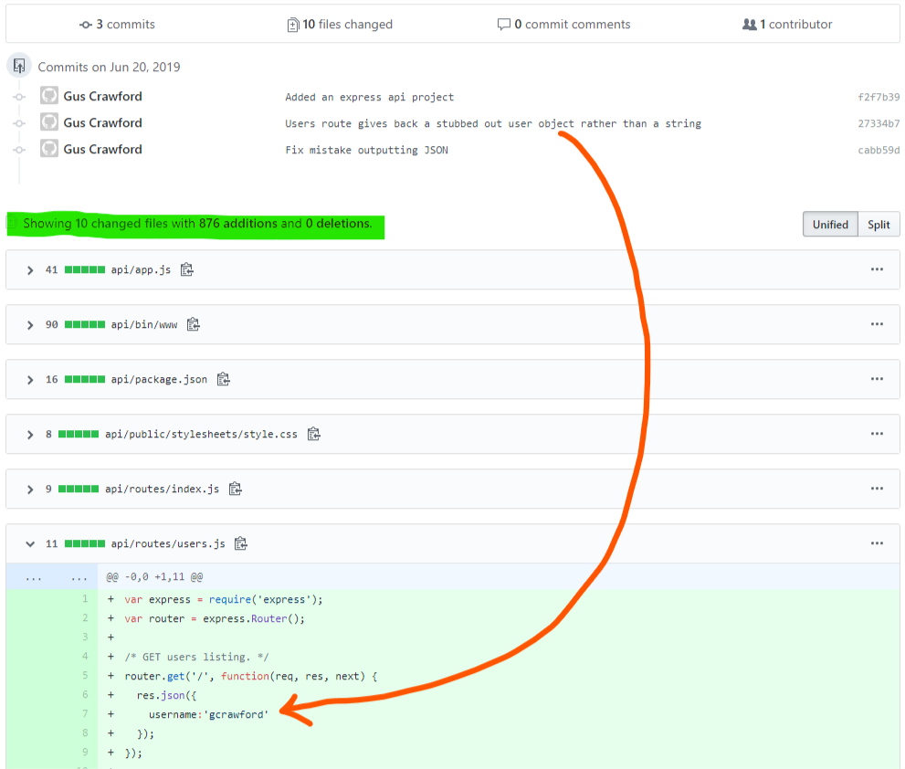
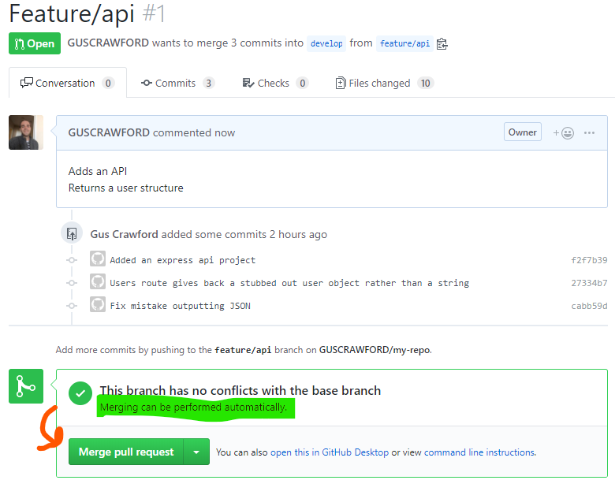

# The Practical Guide to MEAN Stack Development

*Fundamentals of Git*


## 4 Git'r Done

There are few different solutions out there that solve the problem of iteratively developing a large application.

Foremost among them all in universal adoption; is Git.

### A Brief Overview

Git's development was lead by Linus Torvaldis; in turn to support developing the Linux kernal&mdash;a large project that essentially implemented *Unix* operating system with open-source code (one can imagine the large team and vast dirth of code coming from different source authors).

#### Problems with Centralized Version Control Systems

A *centralized* version control system (like SVN or TFS Version Control) break down to **online** buckets of code a developer can read and write from.  The "tracking" of code-updates and maintainence of the edge versions are managed by the server hosting the code and providing the checking in-and-out of source.

Some of the drawbacks to this model as per the [best answer on Stack Overflow contrasting Git and CVS](https://stackoverflow.com/questions/802573/difference-between-git-and-cvs):

* Checking out branch versions in a CVS is slow (a branch in most CVS systems is a complete copy of the entire source-set)
  * Most CVS system track changesets at a *file* level
  * Merging multiple branches with related changes but isolated file updates can be very confusing when settling a conflict
* One needs to be online to manage to their "checkout" and the integrity of the localized edits for later pushing as a further side-affect of the per-file tracking model
  * An unusual merge operation can leave the repo in an inconsistent state
* There is no concept of "merge tracking" when reviewing the source of edits to files over history
* Poor handling of binary files in source control
* CVS systems "update, then merge"; which is to say a CVS system will force one to update a source branch first before merging back into it.
  * Another developer could have pushed a revision to the source branch while another was making edits; now they're in a state where they have possibly 3 different sources of conflict; the conflicts they may have already been resolving against the version of the source they had and now conflated with the new conflicts in the updated source.  This can cause great confusion and risk of losing work during a manual conflict resolution.

#### Solutions Provided by Git

* Branching is "cheap" and it's fast:
  * A branch in Git is best described as a set of "differences" relative to a common root branch
  * Switching between branches is extremely fast when compared with most CVS platforms
  * Changes are tracked **atomically** against the entire project:
    * One set of changes may include "differences" to multiple files
    * When merging branch-to-branch; conflicts are presented together encompassing *the entire* set of changes that are in conflict with one another versus branch-to-branch CVS merging which can present conflicts but with little insight into their history or meaning.
* Git is **distributed**; one can be tracking an online repo and "fetch" from it periodically and as nedded.
  * One can push their work to a remote tracking branch and further "request a pull" into a trunk source branch.
  * Merges are always staged; merging work even if there were a file-operation failure or some other snafu; need not destroy the target branch that was being merged into&mdash;the whole operation can be safely discarded and undone
* Git automatically detects binary files and tracks them with less fuss (no marking the files as *binary* as is common CVS or worrying about line-endings)
* Git works by "merging, then updating" which is to say; merging is always done locally against the version of sources present; and gets resolved with it's remote later at the discretion of the development team.  If and when that does happen; again the merge process goes through a "staging" phase first and there is always an opportunity for an "upstreaming" developer to resolve conflicts isolated purely with the branch he/she targetting and their added work.

#### In Short Git is Better Because...

1. It's faster
   1. ... to get code
   2. ... to create branches
   3. ... to checkout branches
   4. ... merging branches
2. It's cleaner
   1. ... to merge sets of changes to files providing one discreet new piece of business-value; then to merge sets of changes to files providing *multiple* pieces of new business-value.
   2. ... to manage multiple branches;
      1. No more "branch folders"
      2. Not necessary to "tag" a branch
   3. ... to manage the integrity of the work:
      1. The repo is indexed in-place on each computer that has it
      2. Tangent work that makes it back upstream always maintains a clear history of the author
3. It's free
   1. ... like speech! (Not beer)
   2. Git is open-source; one doesn't need a license to use it at scale or for any particular purpose

## Get Started

*You'll need to at minimum install the Git binary from git.*

While there is a dirth of graphically-oriented tools for managing git repositories that will make your life easier; for the purposes of this session we'll focus on using the *command-line interface* to perform our git operations to build the comfortability and understanding of the underlying commands a nifty tool like *Git Kraken* or *Source Tree* ride on top of.

Refer to [Getting Ready: Install Git](../node-js/0-getting-ready.md#install-git) for installing the git binary on your system.

You can test that you've installed git and it's available to `PATH` by entering in your terminal:

```
$>git --version
git version 2.21.0.windows.1
```

If you get back output to the effect of "command not found" review your installation process.

🎯 **TIP** *You can always use the `--help` switch when running any git command for more details. (i.e. `git init --help` will display help on the "init" sub-command)*

### The Repo

A repo or *repository* is a collection of code in a folder.

A **git repo** is a folder that has been set up with metadata about the source, in a hidden folder called *.git*.

```
$> mkdir my-repo && cd my-repo
$my-repo> git init
Initialized empty Git repository in C:/Users/gcrawford/practical-guide-to-mean-stack/examples/my-repo/.git/
```

You can generate this folder when *creating* a repository by using the command `git init` as illustrated above:

The **.git** folder is *hidden* so one may need to edit some file-explorer settings on their desktop to see it; but it is there.  Poke around and have a look but there is not much metadata here that will make sense to a human being; but this is where all the good stuff is that git needs to track our project's changes.

### What's in the Repo?

*These concepts would apply to **any** source control system; but just to review some fundamentals...*

The repository; agnostic of which language one codes in should really only contain "buildable" *source-code* and resource files necesary for that build/compilation process.

Things like build-artifacts, compiled binaries (including dependencies like those in the *node_modules* folder) etc. should broadly not be included.

Additionally, sensitive information like database connection strings; encryption keys, and evrionment variable settings ought to be *ignored* from source control.

If one finds themselves adding items that should conceptually be ignored to source-control; take a deep breath and ask why it's neccessary and keep in mind:

* The larger *any* repository is; regardless of the version-control platform's effeciency&mdash;the slower it is to clone, change branches, and commit.
* Consider who has access to the repository; there could be situations where maybe aforementioned files might be included as an example to further create a localized environment; but certainly encryption keys, environment variable settings and other sensetive particulars about *environments* are dangerous to share and irritating to override later as the artifacts generated from the source are deployed.

#### .gitignore and .gitkeep

To manage what gets tracked or ignored by git; we can write file matching patterns (a.k.a. "globs") in a file aptly named *.gitkeep* or *.gitignore* for keeping and ignoring files respectively.

**.gitkeep** is less commonly used; it's most often used simply as an empty file, in an empty folder that is necessary for project-specific run-time reasons (i.e. one has some sort of output directly and your application will fail if it's not there).  **Git does not track empty directories.**

**.gitignore** is frequently used; and typically one will find a *.gitignore* at the root of most repositories containing code from any stack.  For illustrative purposes we'll create an example .gitignore file as so:

```
node_modules
```

*That's it!*  Git will ignore the path *~/node_modules* where **~** is the location of the repository root.

Say the repository is a **monorepo** storing several projects; each with their own *node_modules* folder; we could alter our .gitignore's "ignore node_modules" directive by prefixing that folder with a *glob* meaning "ignore any folder named *node_modules*, recursively (contained in *any* folder of the repo)

```
**/node_modules
```

#### Staging and Committing Changes

When we alter source code in git and we've made an improvement or added value; we want to "save" that work.  "Saving" is refered to as *committing* in the git world (similar to *check-in* in many CVS systems like TFS) but before we can commit we need to **stage** those changes.

##### git status

Before doing anything; it's reccommended to run a `git status` command and remind oneself:

* "Which branch am I on?"
* "What changes have I made?"

*The current branch and active changes are typically color-coded or otherwise indidcated in one's IDE (with support for git or an extension accomplishing as much) or Git-Gui*

```
$my-repo> git status
On branch master

No commits yet

Untracked files:
  (use "git add <file>..." to include in what will be committed)

        .gitignore

nothing added to commit but untracked files present (use "git add" to track)
```

In the above example we can see:

1. That we're on branch "master", answering the question "Which branch am I on?" (every repository has at least one branch; when we ran `git init` inside our **my-repo** folder we created this *master* branch).
2. There have been no commits yet in this repository.
3. There are *untracked files*, answering the question "What changes have I made?"

Now the .gitignore (and .gitkeep) can be considered source and should be tracked by source control, so let's go ahead and *stage* those changes now by following the directions that git gave us: *... use "git add" to track"

1. Run this terminal command from your git repo's directory: `git add .gitignore`
2. Run `git status` again to see what's changed...

```
$my-repo>git add .gitignore

$my-repo>git status
On branch master

No commits yet

Changes to be committed:
  (use "git rm --cached <file>..." to unstage)

        new file:   .gitignore
```

Now it's clear that the .gitignore file is *staged* (in the list of *changes to be committed*).

##### git commit

Great, changes are staged so let's *commit* to them as so:

```
$my-repo>git commit -m "Added a .gitignore file to ignore node_modules"
[master (root-commit) 210bc33] Added a .gitinore file to ignore node_modules
 1 file changed, 1 insertion(+)
 create mode 100644 .gitignore
```

To put it simply; we added a file to source control which git indicated to us with it's output *create mode* and then a 6 digit number composing a git *index-format* and *file permissions* best delved into with these great stack overflow answers ([file permisions](https://stackoverflow.com/a/737877), [index-format](https://stackoverflow.com/a/8347325)).

You ***cannot commit*** without passing a *message* to log along with your commit; in our case we "*Added a .gitignore...*"

Let's further modify our *.gitignore* as mentioned above and ignore **all node_modules directories** throughout the project as we've established they should never be in source-control.

Update the **.gitignore** as so:

```
**/node_modules
```

Once you've made that edit and saved it; when you run `git status` again you'll get a notice that you have modified a tracked file:

```
$my-repo>git status
On branch master
Changes not staged for commit:
  (use "git add <file>..." to update what will be committed)
  (use "git checkout -- <file>..." to discard changes in working directory)

        modified:   .gitignore

no changes added to commit (use "git add" and/or "git commit -a")
```

Similar to our earlier status report; we've got unstaged changes.

1. Stage them `git add .gitignore`
2. Commit them `git commit -m "Edited .gitignore so that repository can contain multiple node projects"`

The full disection of running those commands (with an intermediary `git status` so you can see what's been staged):

```
$my-repo>git add .gitignore

$my-repo>git status
On branch master
Changes to be committed:
  (use "git reset HEAD <file>..." to unstage)

        modified:   .gitignore

$my-repo>git commit -m "Edited .gitignore so that repository can contain multiple node projects"
[master 245d117] Edited .gitignore so that repository can contain multiple node projects
 1 file changed, 1 insertion(+), 1 deletion(-)
```

#### git branch

One of the greatest advantages of git over other source-control systems is it's speed and efficiency when branching.

Without getting into the details of *what* we're doing; lets scaffold some essential source-code take ***my-repo*** in some kind of direction.

In previous *[MEAN Stack Sessions](../node-js/2b-express-fundamentals#global-packages)* we've covered NodeJS, express and express-generator; so let's use that to create an api-project.

We're going to be making some wild changes; presuming we had a working source already; it's risky what we're doing so we want to create a *branch* of code that is our own version of source we experiment with.

We use the namesake `branch` git sub-command to accomplish this.  By itself, running `git branch` lists all the branches our repository has, and indicates which one is currenly checked out.

```
$my-repo>git branch
* master
```

As previously noted, we only have one branch; ***master*** and it was created automatically for us when we ran `git init` inside our test repository *my-repo*.

##### "Trunk" Branches

Before we go crazy with our updated version of our project with an API; let's take a moment to talk about *"trunk"* branches.  Trunk branches are special because they contain the most stable versions of an application's source.  In our example case; *master* is our trunk branch.  In practicality; *master* usually contains the *last released* version of code.  It should be the most stable, should have the least partialy-coded features; and should stand-up on it's own with the least work and configuration.

Commonly when working on a ***next release***, and especially while working collaboratively on a project with other developers&mdash;the most stable *edge version* of code is commited against a ***develop*** branch.  While you don't have to name your *development* branch "develop" it is very conventional to do so and it is recommended for consistency.

Before we create our branch of code with our new *feature*.  Let's go ahead and ensure we have an isolated *development* branch to use so that we don't impact *master*.

To create a branch in git, run the command `git branch <new branch name>`.

Create the *develop* branch:

```
$my-repo>git branch develop
$my-repo>git branch
* master
  develop
```

There was no output from the *branch* command but we can run it again without a name argument and see that we indeed created a **develop** branch.

Let's "check out" *develop* as so:

```
$my-repo>git checkout develop
Switched to branch 'develop'
```

By default; when you create a branch; the new branch pivots from the branch you were on.  That is to say "the version of code you have when branching is the version you start your new branch with".

For our purposes right this second; *develop* and *master* can contain the same version of code; and frequently do early on in any project.

##### "Feature" Branches

A "feature" branch is a version of code that is conceptually adding a new *feature* to the value of the project.

A valuable shorthand if you regularly do your git'ing over the command line is `git checkout -b <new branch to create and checkout>` which creates a branch *and* checks it out in one fell-swoop.

We were going to create an API so lets create feature branch for this purpose:

```
$my-repo>git checkout -b feature/api
$my-repo>git branch
  develop
* feature/api
  master
```

A lot of git tools will allow you to collapse related branches into 'directories' of sort based on their naming.  So it's not a bad idea to organize your *feature* branches into a top-level collection of branches with that namesake&mdash;hence the **feature/**api prefix.

All we essentially want to do in this branch; is create an API project with **express-generator**:

```
$my-repo>express api && cd api

  warning: the default view engine will not be jade in future releases
  warning: use `--view=jade' or `--help' for additional options


   create : api\
   create : api\public\
   create : api\public\javascripts\
   create : api\public\images\
   create : api\public\stylesheets\
   create : api\public\stylesheets\style.css
   create : api\routes\
   create : api\routes\index.js
   create : api\routes\users.js
   create : api\views\
   create : api\views\error.jade
   create : api\views\index.jade
   create : api\views\layout.jade
   create : api\app.js
   create : api\package.json
   create : api\bin\
   create : api\bin\www

   change directory:
     > cd api

   install dependencies:
     > npm install

   run the app:
     > SET DEBUG=api:* & npm start
$my-repo/api>yarn install
yarn install v1.13.0
info No lockfile found.
[1/4] Resolving packages...
warning jade@1.11.0: Jade has been renamed to pug, please install the latest version of pug instead of jade
warning jade > constantinople@3.0.2: Please update to at least constantinople 3.1.1
warning jade > transformers@2.1.0: Deprecated, use jstransformer
[2/4] Fetching packages...
[3/4] Linking dependencies...
[4/4] Building fresh packages...
success Saved lockfile.
warning Your current version of Yarn is out of date. The latest version is "1.16.0", while you're on "1.13.0".
info To upgrade, download the latest installer at "https://yarnpkg.com/latest.msi".
Done in 2.62s.
```

1. We created an express application called "api" in a namesake folder and switched our working path there
2. We installed the dependencies for that generated project

We made changes, let's run `git status` again:

**NOTE** while working in *~my-repo/api* and running **git commands**; git searches upward in parent directories until it finds the **.git** metadata folder so as long as we're in a child directory of the repo we're still working against the same repo.

```
$my-repo/api>git status
On branch feature/api
Untracked files:
  (use "git add <file>..." to include in what will be committed)

        ./
```

The output above is essentially telling us that the current folder we're in is untracked, so let's **stage** it with the `add` command:

```
$my-repo/api>git add ./
warning: LF will be replaced by CRLF in api/app.js.
The file will have its original line endings in your working directory
...

$my-repo/api>git status
On branch feature/api
Changes to be committed:
  (use "git reset HEAD <file>..." to unstage)

        new file:   api/app.js
        new file:   api/bin/www
        new file:   api/package.json
        new file:   api/public/stylesheets/style.css
        new file:   api/routes/index.js
        new file:   api/routes/users.js
        new file:   api/views/error.jade
        new file:   api/views/index.jade
        new file:   api/views/layout.jade
        new file:   api/yarn.lock
```

After adding the the api directory to source control, we got this message, "warning: LF will be replaced by CRLF in api/app.js.
The file will have its original line endings in your working directory" and in fact several of them for different files, removed from the example for brevity.

This is because the author is writing this tutorial on a windows machine where the conventional way to indicate a line-ending in a text file is `\r\n` (carriage-return, line-feed) in contrast to the files produced by the **express-generator** which use the `\n` (linefeed) character to indicate line-endings (as is the convention on Macs, Linux and other "Unixy" operating systems).

You can safely ignore this for now; but for situations where code-authors or CI systems are based in platforms outside of windows; knowing how to configure git to consider [whitespace formatting](https://git-scm.com/book/en/v2/Customizing-Git-Git-Configuration#Formatting-and-Whitespace) can be useful.

Beyond the warnings about whitespace conversions that were made to our files so they display correctly (many windows editors display unixy text files perfectly fine; but had this conversion not been made and you opened one of these files in say *Notepad* you'd notice a lack of linebreaks) we can see that we staged some commonly generated express-application files.

If you look inside your *api* project folder; you should see a *node_modules* folder that keeps the project's installed dependencies; but you should not see any files in that directory staged for commit because we *ignored* all *node_modules* folders everywhere in the *.gitignore*.

Let's *save our version of this project with an api* and commit our staged changes:

```
$my-repo/api>git commit -m "Added an express api project"
[feature/api f2f7b39] Added an express api project
 10 files changed, 874 insertions(+)
 create mode 100644 api/app.js
 create mode 100644 api/bin/www
 create mode 100644 api/package.json
 create mode 100644 api/public/stylesheets/style.css
 create mode 100644 api/routes/index.js
 create mode 100644 api/routes/users.js
 create mode 100644 api/views/error.jade
 create mode 100644 api/views/index.jade
 create mode 100644 api/views/layout.jade
 create mode 100644 api/yarn.lock

 $my-repo/api>git status
On branch feature/api
nothing to commit, working tree clean
```

To really concretely illustrate what we've accomplished by branching and generating our new API on an isolated version of project, *check out* our **develop** (`git checkout develop`) branch and watch all the files in *api* disappear (you'll notice the folder structure has remained; go ahead and delete this too if you wish).

Checkout **feature/api** again: `git checkout feature/api`

We know we've got a value-adding branch now with an API; but let's make some further experimentations to it that return a stubbed out user instead of 'resond with a resource' when we make the call to `GET lochalhost:3000/users`:

1. Let's create *another feature branch*, based on the current branch we're on now: `git checkout -b feature/api-user`
2. Edit *~/api/routes/users.js*

Change this code on **line 4**:

```
/* GET users listing. */
router.get('/', function(req, res, next) {
  res.send('respond with a resource');
});
```

To this code that returns a stubbed out JSON *user*:

```
/* GET users listing. */
router.get('/', function(req, res, next) {
  res.json({
      username:'gcrawford'
  });
});
```

1. `git add routes/users.js`
2. `git commit -m "Users route gives back a stubbed out user object rather than a string"`

Great, just to summarize all the changes we made:

1. We created a *.gitignore*
2. We branched off and created an API with express (**feature/api**)
3. We branched off from that and started working on the **users** route we added on the previous branch (**feature/api-user**)

Locally, we're ready to *merge* our work on the user route back into the main feature branch **feature/api**.

#### git merge

Since we've got one branch (**feature/api**) and another ahead of that (**feature/api-user**) value-adding an API framework and initial user-structure respectively; let's add back in our work on the user to the wholistic addition of the API by *merging* **feature/api-user** into **feature/api**.

Whenever you merge you follow these steps:

1. Checkout the branch you want to "merge into" `git checkout feature/api`
2. Run the merge command `git merge <branch you wish to merge into the one you're on>` (i.e. `git merge feature/api-user`)

The effect of the above is traced below:

```
$my-repo\api>git checkout feature/api
Switched to branch 'feature/api'

$my-repo\api>git merge feature/api-user
Updating f2f7b39..27334b7
Fast-forward
 api/routes/users.js | 4 +++-
 1 file changed, 3 insertions(+), 1 deletion(-)
```

We get a similar output as when we commit changes; only we see a new term *Fast-forward* which we'll not discuss in deep-sea depth now, but it's worth pointing out that we had a linear progression of branching and code edits.  When we branched from **develop** on to **feature/api** and *committed* the new express API, we got *ahead* by one commit.

A *commit* is a "difference" in code relative to another commit.  A branch; is in and of itself nothing more complicted than a "named commit".  **develop** branch and **master** are still pointing at the *same commit* currently and are different names for the same version of code.

Since our **feature/api-user** was wholly *ahead* of **feature/api**, git had nothing more to do to accomplish our merge for us than pointing our branch named **feature/api** to the same commit pointed to by **feature/api-user**.  Hence the *Fast-forward*.

Sweet!  All the work done on the api is all in one place; and it's time to further merge that work into the least stable "trunk" *development* branch **develop** which conceptually contains everything we're currently planning to offer in the **next release**.

"No sweat!", you say, "I know how to branch and merge!".  You certainly do; *but* let's stop here and take a look at another approach to *pushing* our work and think about our project in the context of teamwork.

#### Remotes, Tracking Branches, and Pull-Requests

You certainly *could* simpy merge your feature branch back into *develop* but this is a **bad practice** to locally merge into your trunk branches.

The reasoning is wholly rooted in good teamwork; so pretend we're working with a team on our example *my-repo*.

While git is *distributed* and works just great offline; you typically as a practice **do not want to be testing or developing against localized edits in a trunk branch** that your team-mates do not have.  When you do so, you add risk because:

1. your baseline version of working code is no longer the same
2. you may start a feature branch pivoting from develop that inherits unintended code-changes
3. subsequent "pulls" from a remote version of develop may conflict with local edits

Since we're pretending we work on a huge team and they all have the same *develop* branch as we do; let's create a "remote" repository online that we can use to publish our current develop branch with; then let's take a look at how we can push up our new feature branch *and get sign-off and input from our team*

##### Adding a Remote

A *remote* repository is a git repository just like the one you're working on; only it's on a server computer somewhere.

There are loads of providers out there offering *free* (typically for **open-source** projects) remote repos; for our purposes I'll suggest [Git Hub](https://github.com) and leave a brief set of tasks to complete on that site:

1. Create an account if you don't already have one
2. Create a new repository
   1. Name it what you like (I've created an illustrative one aptly named *[my-repo](https://github.com/GUSCRAWFORD/my-repo.git)* as per our example)
   2. Leave **unchecked** the option "Initialize this repository with a README"
3. In your terminal from your repo, you'd **add the *origin***
   1. `git remote add origin <URI to your remote.git>` (i.e. Author typed: `git remote add origin https://github.com/GUSCRAWFORD/my-repo.git`)
   2. `git push -u origin master` This *pushes* your local commit(s) (we have one on master) from the *master branch* and further asks that our *local master* **track the remote master**

Trace through the full output of having completed this:

```
$my-repo\api>git remote add origin https://github.com/GUSCRAWFORD/my-repo.git

$my-repo\api>git push -u origin master
Enumerating objects: 6, done.
Counting objects: 100% (6/6), done.
Delta compression using up to 8 threads
Compressing objects: 100% (2/2), done.
Writing objects: 100% (6/6), 518 bytes | 259.00 KiB/s, done.
Total 6 (delta 0), reused 0 (delta 0)
To https://github.com/GUSCRAWFORD/my-repo.git
 * [new branch]      master -> master
Branch 'master' set up to track remote branch 'master' from 'origin'.
```

We have pushed our first and main trunk branch, and we've set our trunk branch to further track the newly pushed branch.

Let's ensure we also push and track **develop** as so: `git push -u origin develop`

##### Pull-Requests

Rather than merging our feature branch into develop on our own machine which would only benefit us (arguablly); let's share the improvement with code and ask that the *whole team **pull** in our changes to **develop** for the benefit of all*.

The first step is to push up our feature branch (tracking is not necessary, but it is recommended for teamwork purposes) so it can be reviewed against *develop*: `git push -u origin feature/api`

After doing that, we can create a "pull request" asking the team to review the code changes coming from **feature/api** to **develop**.

Typically once you've pushed your feature branch to the remote; you can create a pull-request from the remote git provider's portal as illustrated below:

[Git Hub detects recently pushed changes and offers the option of a pull-request](!./git-hub-detected-code-changes.png)

*The exact process of creating a **pull-request** on a given remote git-providers like **Git Hub** is not always the same but frequently similar; because this is not an excercise in learning git-hub we'll cover creating a pull-request from the command-line; but point out that this isn't done very often in all practicality*

Using the terminal you can create a pull-request through git on your remote like so: `git request-pull <pull changes into this branch> <from this repo URI> <from this branch>`

Observe the traced output of having done so with **my-repo**:

```
$my-repo\api>git request-pull develop https://github.com/GUSCRAWFORD/my-repo.git feature/api
The following changes since commit 245d11730c7d4c627c2b4fd7f4cf309e096bbd27:

  Edited .gitignore so that repository can contain multiple node projects (2019-06-20 12:27:42 -0400)

are available in the Git repository at:

  https://github.com/GUSCRAWFORD/my-repo.git feature/api

for you to fetch changes up to cabb59de788d612b692aaec68e43faa2e8179cc5:

  Fix mistake outputting JSON (2019-06-20 14:32:03 -0400)

----------------------------------------------------------------
Gus Crawford (3):
      Added an express api project
      Users route gives back a stubbed out user object rather than a string
      Fix mistake outputting JSON

 api/app.js                       |  41 +++
 api/bin/www                      |  90 ++++++
 api/package.json                 |  16 +
 api/public/stylesheets/style.css |   8 +
 api/routes/index.js              |   9 +
 api/routes/users.js              |  11 +
 api/views/error.jade             |   6 +
 api/views/index.jade             |   5 +
 api/views/layout.jade            |   7 +
 api/yarn.lock                    | 683 +++++++++++++++++++++++++++++++++++++++
 10 files changed, 876 insertions(+)
 create mode 100644 api/app.js
 create mode 100644 api/bin/www
 create mode 100644 api/package.json
 create mode 100644 api/public/stylesheets/style.css
 create mode 100644 api/routes/index.js
 create mode 100644 api/routes/users.js
 create mode 100644 api/views/error.jade
 create mode 100644 api/views/index.jade
 create mode 100644 api/views/layout.jade
 create mode 100644 api/yarn.lock
```

As illustrated earlier above; we can also manage the pull requests from the remote provider's portal; in-fact this is the *most common way* to make pull-requests as it's usually easier to filter changes coming in, make comments, and have a review process before changes are finalized into a trunk-branch like *develop*.

*General anatomy of a Pull Request*





Once you're happy and ready to go into review; complete creating your pull-request:

1. This doesn't merge code; rather it creates the "staged" merge state as mentioned much earlier in the lesson
2. During the staging; git does a dry run of the merge and verifies that the code changes being merged don't **conflict** (which will get discussed later)
3. Once the team has approved the changes; the pull-request can be completed



##### Locally Fetching and Pulling

Congratulations on your first *PR* (pull-request)!  Let's be sure to *update our **local** develop branch* the same way that our team would:

1. Check-out **develop**: `git checkout develop`
2. For illustrative purposes; watch your files disappear again!
3. **Fetch the latest info from the remote**: `git fetch`
4. **Pull** the latest version of the remote branch being tracked locally by the branch we're on: `git pull`

The full traced output of the above is illustrated:

```
$my-repo/api>git fetch
remote: Enumerating objects: 1, done.
remote: Counting objects: 100% (1/1), done.
remote: Total 1 (delta 0), reused 0 (delta 0), pack-reused 0
Unpacking objects: 100% (1/1), done.
From https://github.com/GUSCRAWFORD/my-repo
   245d117..6a1b4d1  develop    -> origin/develop

$my-repo/api>git pull
Updating 245d117..6a1b4d1
Fast-forward
 api/app.js                       |  41 +++
 api/bin/www                      |  90 ++++++
 api/package.json                 |  16 +
 api/public/stylesheets/style.css |   8 +
 api/routes/index.js              |   9 +
 api/routes/users.js              |  11 +
 api/views/error.jade             |   6 +
 api/views/index.jade             |   5 +
 api/views/layout.jade            |   7 +
 api/yarn.lock                    | 683 +++++++++++++++++++++++++++++++++++++++
 10 files changed, 876 insertions(+)
 create mode 100644 api/app.js
 create mode 100644 api/bin/www
 create mode 100644 api/package.json
 create mode 100644 api/public/stylesheets/style.css
 create mode 100644 api/routes/index.js
 create mode 100644 api/routes/users.js
 create mode 100644 api/views/error.jade
 create mode 100644 api/views/index.jade
 create mode 100644 api/views/layout.jade
 create mode 100644 api/yarn.lock
```

Notice that the files in **api** have reappeared, as your local **develop** is now up to date with the remote/**develop**


#### Gitflow

*Let's spend a moment exploring the **git flow** work-flow helper.  It's optional, but it saves you some time and makes common tasks easier/faster as well as promoting good work-habits.*

Out of the box with your windows installation of git; you have an extension called *flow* that essentially wraps git and manages branch naming for you.  For more on that checkout this tutuorial from [Atlassian](https://www.atlassian.com/git/tutorials/comparing-workflows/gitflow-workflow).

In short; run this command in your repo to set up *git flow*: `git flow init`

Running the command brings up an interactive terminal wizard allowing you to set some conventions:

```
$my-repo>git flow init

Which branch should be used for bringing forth production releases?
   - master
Branch name for production releases: [master]
Branch name for "next release" development: [develop]

How to name your supporting branch prefixes?
Feature branches? [] feature/
Bugfix branches? [] fix/
Release branches? [] release/
Hotfix branches? [] hotfix/
Support branches? [] support/
Version tag prefix? [] version-
Hooks and filters directory? [C:/Users/gcrawford/practical-guide-to-mean-stack/examples/my-repo/.git/hooks]
```

Now if we needed to work on a new feature branch; we can enter the following in the terminal: `git flow feature start new-work`

```
$my-repo\api>git flow feature start new-work
Switched to a new branch 'feature/new-work'

Summary of actions:
- A new branch 'feature/new-work' was created, based on 'develop'
- You are now on branch 'feature/new-work'

Now, start committing on your feature. When done, use:

     git flow feature finish new-work
```

In all practicality; when working with a remote team it's not recomended to use the command `git flow feeature finish new-work` *before* you've completed your pull-request as this would be merging into your local **develop** rather than pushing your branch; however doing it *after* would be safe as long as you've made no further commits after completing your review and updating the remote develop because you'd essentially be *fast-forwarding* your local to the same commit anyway. 
